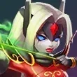

# 📋 DOCUMENTACIÓN TÉCNICA COMPLETA - Lords Mobile Guía de Cacería v1.0

## 🎯 OVERVIEW

**Aplicación:** PWA (Progressive Web App) de guía de cacería de monstruos para Lords Mobile  
**Usuario:** knayus (knayus@gmail.com)  
**Archivo único:** index.html (186KB - HTML + CSS + JavaScript + datos embebidos)  
**Fuente de datos:** Caceria.xlsm (Excel con 25 hojas de monstruos)

**Características principales:**
- 25 monstruos (24 normales + 1 especial)
- 57 héroes (20 F2P + 4 Evento + 33 P2P)
- Equipos personalizables con localStorage
- Sistema import/export de configuración
- Drop rates para cada monstruo
- Protecciones anti-copia
- Diseño responsive

---

## 📁 ESTRUCTURA DE ARCHIVOS

```
/
├── index.html                    # App completa (186KB)
├── manifest.json                 # PWA config
├── img/
│   ├── fondo_epico.webp         # Fondo pantalla inicio
│   ├── monstruos/
│   │   ├── abeja_reina.webp
│   │   ├── alaescarcha.webp
│   │   ├── alanegra.webp
│   │   ├── ballena_artica.webp
│   │   ├── bestia_de_nieve.webp
│   │   ├── buen_apetito.webp
│   │   ├── buho_carronero.webp
│   │   ├── caballo_de_troya.webp
│   │   ├── caballero_fantasma.webp
│   │   ├── chaman_voodoo.webp
│   │   ├── drider_infernal.webp
│   │   ├── gargantua.webp
│   │   ├── gorila.webp
│   │   ├── grifo.webp
│   │   ├── guiverno_jade.webp
│   │   ├── la_muerte.webp
│   │   ├── megalarva.webp
│   │   ├── moai_milenario.webp
│   │   ├── necrosis.webp
│   │   ├── noceros.webp
│   │   ├── rugido_feroz.webp
│   │   ├── saberfang.webp
│   │   ├── serpiente_gladiador.webp
│   │   ├── titan_de_marea.webp
│   │   └── terrospin.webp
│   └── heroes/
│       ├── hijo_de_la_luz.webp
│       ├── caballero_letal.webp
│       ├── guardian.webp
│       ├── caballera_de_la_rosa.webp
│       ├── forjador_de_almas.webp
│       ├── cuervo_negro.webp
│       ├── arquera_letal.webp
│       ├── matademonios.webp
│       ├── cuervo_nocturno.webp
│       ├── rayo_escarlata.webp
│       ├── sombra.webp
│       ├── estafador.webp
│       ├── rastreadora.webp
│       ├── duende_bombardero.webp
│       ├── elementalista.webp
│       ├── incineradora.webp
│       ├── prima_donna.webp
│       ├── sabio_del_viento.webp
│       ├── escudero_del_mar.webp
│       ├── reina_de_la_nieve.webp
│       ├── maestro_bombardero.webp
│       ├── dragon_del_caos.webp
│       ├── pegaso.webp
│       ├── vigilante.webp
│       ├── barbaro.webp
│       ├── berserker.webp
│       ├── don_guapo.webp
│       ├── guardian_del_bosque.webp
│       ├── el_magmaroide.webp
│       ├── cambiaformas.webp
│       ├── vapobot.webp
│       ├── el_grandulon.webp
│       ├── centauro_vengativo.webp
│       ├── cazadora_maldita.webp
│       ├── guia_eterea.webp
│       ├── mujer_fatal.webp
│       ├── lobo_severo.webp
│       ├── mente_tejedora.webp
│       ├── maestro_cocinero.webp
│       ├── principe_de_ladrones.webp
│       ├── doncella_escudo.webp
│       ├── rompeolas.webp
│       ├── cronista.webp
│       ├── seguidor_oscuro.webp
│       ├── mago_oscuro.webp
│       ├── bruja_onirica.webp
│       ├── necroduque.webp
│       ├── oraculo.webp
│       ├── diablilla.webp
│       ├── sabio_del_desierto.webp
│       ├── princesa_caracol.webp
│       ├── cantante_marina.webp
│       ├── zorro_de_la_tormenta.webp
│       ├── sacerdotisa_de_crepusculo.webp
│       ├── alquimista_errante.webp
│       └── muneca_mecanica.webp
├── README.md
└── RESUMEN_DESARROLLO.md
```

**CRÍTICO:** Las rutas de imágenes NO llevan `/` inicial (para compatibilidad con GitHub Pages):
- ✅ Correcto: `img/monstruos/abeja_reina.webp`
- ❌ Incorrecto: `/img/monstruos/abeja_reina.webp`

---

## 👥 HÉROES (57 TOTAL)

### F2P (20):
1. Hijo de la Luz
2. Caballero Letal
3. Guardián
4. Caballera de la Rosa
5. Forjador de Almas
6. Cuervo Negro
7. Arquera Letal
8. Matademonios
9. Cuervo Nocturno
10. Rayo Escarlata
11. Sombra
12. Estafador
13. Rastreadora
14. Duende Bombardero
15. Elementalista
16. Incineradora
17. Prima Donna
18. Sabio del Viento
19. Escudero del Mar
20. Reina de la Nieve

### EVENTO (4):
21. Maestro Bombardero
22. Dragón del Caos
23. Pegaso
24. Vigilante

### P2P (33):
25. Bárbaro
26. Berserker
27. Don Guapo
28. Guardián del Bosque
29. El Magmaroide
30. Cambiaformas
31. Vapobot
32. El Grandulón
33. Centauro Vengativo
34. Cazadora Maldita
35. Guía Etérea
36. Mujer Fatal
37. Lobo Severo
38. Mente Tejedora
39. Maestro Cocinero
40. Príncipe de Ladrones
41. Doncella Escudo
42. Rompeolas
43. Cronista
44. Seguidor Oscuro
45. Mago Oscuro
46. Bruja Onírica
47. Necroduque
48. Oráculo
49. Diablilla
50. Sabio del Desierto
51. Princesa Caracol
52. Cantante Marina
53. Zorro de la Tormenta
54. Sacerdotisa de Crepúsculo
55. Alquimista Errante
56. Muñeca Mecánica

**Conversión nombre → archivo:**
```javascript
function heroToFilename(name) {
    return name
        .toLowerCase()
        .replace(/ /g, '_')
        .replace(/á/g, 'a')
        .replace(/é/g, 'e')
        .replace(/í/g, 'i')
        .replace(/ó/g, 'o')
        .replace(/ú/g, 'u')
        .replace(/ñ/g, 'n');
}

function getHeroImage(heroName) {
    return `img/heroes/${heroToFilename(heroName)}.webp`;
}
```

**Ejemplos:**
- "Cuervo Negro" → `cuervo_negro.webp`
- "Muñeca Mecánica" → `muneca_mecanica.webp`
- "Sacerdotisa de Crepúsculo" → `sacerdotisa_de_crepusculo.webp`

---

## 🐲 MONSTRUOS (25 TOTAL)

### Normales (24):
1. Abeja Reina
2. Alaescarcha
3. Alanegra
4. Ballena Ártica
5. Bestia de Nieve
6. Buen Apetito
7. Buho Carroñero
8. Caballo de Troya
9. Chamán Voodoo
10. Drider Infernal
11. Gargantua
12. Gorila
13. Grifo
14. Guiverno Jade
15. La Muerte
16. Megalarva
17. Moai Milenario
18. Necrosis
19. Noceros
20. Rugido Feroz
21. Saberfang
22. Serpiente Gladiador
23. Titán de Marea
24. Terrospín

### Especial (1):
25. Caballero Fantasma (estructura diferente, sin niveles)

**Conversión nombre → archivo:** (misma función que héroes)
- "Abeja Reina" → `abeja_reina.webp`
- "Chamán Voodoo" → `chaman_voodoo.webp`
- "Titán de Marea" → `titan_de_marea.webp`

---

## 📐 ESTRUCTURA DE DATOS JSON

### Monstruo Normal:

```javascript
{
    "name": "Abeja Reina",
    "image": "img/monstruos/abeja_reina.webp",
    "special_structure": false,
    "teams": {
        "f2p": {
            "level1-3": [
                ["Héroe1", "Héroe2", "Héroe3", "Héroe4", "Héroe5"],  // Principal
                ["HéroeA", "HéroeB", "HéroeC", "HéroeD", "HéroeE"]   // Alternativa
            ],
            "level4": [
                ["Héroe1", "Héroe2", "Héroe3", "Héroe4", "Héroe5"]   // Principal
            ],
            "level5": [
                ["Héroe1", "Héroe2", "Héroe3", "Héroe4", "Héroe5"],  // Principal
                ["HéroeA", "HéroeB", "HéroeC", "HéroeD", "HéroeE"]   // Alternativa (si existe)
            ]
        },
        "p2p": {
            "level1-3": [
                ["Héroe1", "Héroe2", "Héroe3", "Héroe4", "Héroe5"],  // Principal
                ["HéroeA", "HéroeB", "HéroeC", "HéroeD", "HéroeE"]   // Alternativa
            ],
            "level4": [
                ["Héroe1", "Héroe2", "Héroe3", "Héroe4", "Héroe5"],  // Principal
                ["HéroeA", "HéroeB", "HéroeC", "HéroeD", "HéroeE"]   // Alternativa
            ],
            "level5": [
                ["Héroe1", "Héroe2", "Héroe3", "Héroe4", "Héroe5"]   // Principal (puede tener alternativa)
            ]
        }
    },
    "dropRates": [
        {
            "item": "Queen Venom",
            "percent": "3.00%",
            "rarity": "Común"
        },
        {
            "item": "Royal Stinger",
            "percent": "6.00%",
            "rarity": "Poco Común"
        },
        {
            "item": "Buzzing Husk",
            "percent": "45.50%",
            "rarity": "Raro"
        },
        {
            "item": "Bee Chrysalis",
            "percent": "45.50%",
            "rarity": "Épico"
        }
    ]
}
```

### Caballero Fantasma (Especial):

```javascript
{
    "name": "Caballero Fantasma",
    "image": "img/monstruos/caballero_fantasma.webp",
    "special_structure": true,
    "teams": {
        "f2p": {
            "heroes": [
                "Cuervo Negro",
                "Cuervo Nocturno",
                "Arquera Letal",
                "Matademonios",
                "Rayo Escarlata",
                "Sombra",
                "Estafador",
                "Rastreadora"
            ]
        },
        "p2p": {
            "heroes": [
                "Mujer Fatal",
                "Maestro Cocinero"
            ]
        }
    },
    "dropRates": []
}
```

---

## 📊 EXTRACCIÓN DE DATOS DEL EXCEL

**Archivo fuente:** `Caceria.xlsm`  
**25 hojas:** Una por cada monstruo (nombre exacto del monstruo como nombre de hoja)

### Python - Código de extracción:

```python
import openpyxl
import json
import re

wb = openpyxl.load_workbook('Caceria.xlsm', data_only=True)

def limpiar_nombre(nombre):
    """Limpia nombres de héroes eliminando números y guiones iniciales"""
    if not nombre:
        return None
    nombre = str(nombre).strip()
    nombre = re.sub(r'^[\d\-\s]+', '', nombre)
    if len(nombre) < 3:
        return None
    return nombre

def extraer_equipos(sheet, start_col, start_row, num_equipos=2):
    """
    Extrae equipos de 5 héroes cada uno
    start_col: columna inicial (2 para F2P, 10 para P2P)
    start_row: fila inicial
    num_equipos: cantidad de equipos a extraer (Principal + Alternativa)
    """
    equipos = []
    for i in range(num_equipos):
        row = start_row + (i * 2)  # Cada equipo está 2 filas abajo
        equipo = []
        for col_offset in range(5):  # 5 héroes por equipo
            valor = sheet.cell(row, start_col + col_offset).value
            nombre = limpiar_nombre(valor)
            if nombre:
                equipo.append(nombre)
        if len(equipo) >= 3:  # Mínimo 3 héroes para ser válido
            equipos.append(equipo)
    return equipos

def extraer_drops(sheet):
    """
    Extrae drop rates desde columna J-L (10-12), filas 7-11
    """
    drops = []
    for row in range(7, 12):
        item = sheet.cell(row, 10).value      # Columna J - Artículo
        percent = sheet.cell(row, 11).value   # Columna K - Porcentaje
        rarity = sheet.cell(row, 12).value    # Columna L - Rareza
        
        if item and percent:
            drops.append({
                'item': str(item).strip(),
                'percent': str(percent).strip(),
                'rarity': str(rarity).strip() if rarity else 'Común'
            })
    return drops

# Extraer todos los monstruos
monstruos_normales = [
    'Abeja Reina', 'Alaescarcha', 'Alanegra', 'Ballena Ártica', 'Bestia de Nieve',
    'Buen Apetito', 'Buho Carroñero', 'Caballo de Troya', 'Chamán Voodoo',
    'Drider Infernal', 'Gargantua', 'Gorila', 'Grifo', 'Guiverno Jade',
    'La Muerte', 'Megalarva', 'Moai Milenario', 'Necrosis', 'Noceros',
    'Rugido Feroz', 'Saberfang', 'Serpiente Gladiador', 'Titán de Marea',
    'Terrospín'
]

data_completa = []

for monstruo in monstruos_normales:
    sheet = wb[monstruo]
    
    # F2P: columna B (2), filas 15-29
    f2p = {
        'level1-3': extraer_equipos(sheet, 2, 15, 2),   # Fila 15, 2 equipos
        'level4': extraer_equipos(sheet, 2, 21, 1),      # Fila 21, 1 equipo
        'level5': extraer_equipos(sheet, 2, 25, 2)       # Fila 25, 2 equipos
    }
    
    # P2P: columna J (10), filas 15-29
    p2p = {
        'level1-3': extraer_equipos(sheet, 10, 15, 2),  # Fila 15, 2 equipos
        'level4': extraer_equipos(sheet, 10, 21, 2),    # Fila 21, 2 equipos
        'level5': extraer_equipos(sheet, 10, 25, 2)     # Fila 25, 2 equipos
    }
    
    drops = extraer_drops(sheet)
    
    # Convertir nombre a filename
    nombre_archivo = monstruo.lower().replace(' ', '_').replace('á', 'a').replace('é', 'e').replace('í', 'i').replace('ó', 'o').replace('ú', 'u').replace('ñ', 'n')
    
    data_completa.append({
        'name': monstruo,
        'image': f'img/monstruos/{nombre_archivo}.webp',
        'special_structure': False,
        'teams': {'f2p': f2p, 'p2p': p2p},
        'dropRates': drops
    })

# Caballero Fantasma (estructura especial)
data_completa.append({
    'name': 'Caballero Fantasma',
    'image': 'img/monstruos/caballero_fantasma.webp',
    'special_structure': True,
    'teams': {
        'f2p': {
            'heroes': ['Cuervo Negro', 'Cuervo Nocturno', 'Arquera Letal', 
                      'Matademonios', 'Rayo Escarlata', 'Sombra', 
                      'Estafador', 'Rastreadora']
        },
        'p2p': {
            'heroes': ['Mujer Fatal', 'Maestro Cocinero']
        }
    },
    'dropRates': []
})

# Guardar JSON
with open('monsters_data.json', 'w', encoding='utf-8') as f:
    json.dump(data_completa, f, ensure_ascii=False, indent=2)
```

**Ubicaciones exactas en Excel:**
- **F2P:** Columna B (índice 2), empezando en fila 15
- **P2P:** Columna J (índice 10), empezando en fila 15
- **Drop Rates:** Columnas J-K-L (índices 10-11-12), filas 7-11
- **Estructura:**
  - Fila 15: Principal nivel 1-3
  - Fila 17: Alternativa nivel 1-3
  - Fila 21: Principal nivel 4
  - Fila 23: Alternativa nivel 4 (si existe)
  - Fila 25: Principal nivel 5
  - Fila 27: Alternativa nivel 5 (si existe)

---

## 🎨 DISEÑO Y ESTILOS CSS

### Paleta de colores:

```css
/* Fondos */
--bg-primary: #1a1a2e;
--bg-secondary: #16213e;
--bg-gradient: linear-gradient(135deg, #1a1a2e 0%, #16213e 100%);

/* Acentos */
--gold: #FFD700;           /* Dorado - títulos */
--blue-dark: #0f3460;      /* Azul oscuro - botones */
--red: #e94560;            /* Rojo - hover, bordes */
--green: #4ecca3;          /* Verde menta - héroes */
--purple: #6b46c1;         /* Púrpura - modales */
--purple-light: #b794f6;   /* Púrpura claro */

/* Texto */
--text-primary: #ffffff;
--text-secondary: rgba(255, 255, 255, 0.8);
```

### Tipografía:

```css
font-family: 'Segoe UI', Tahoma, Geneva, Verdana, sans-serif;
```

### Layout responsive:

```css
/* Monstruos grid */
.monsters-grid {
    display: grid;
    grid-template-columns: repeat(auto-fill, minmax(200px, 1fr));
    gap: 20px;
    padding: 20px;
}

/* Mobile */
@media (max-width: 768px) {
    .monsters-grid {
        grid-template-columns: repeat(auto-fill, minmax(150px, 1fr));
        gap: 15px;
    }
}
```

---

## 📱 ESTRUCTURA DE PANTALLAS

### 1. HOME (Inicio)
```html
<div class="home-screen">
    <div class="home-content">
        <h1>🏰 Lords Mobile</h1>
        <h2>Guía de Cacería de Monstruos</h2>
        <button onclick="showMonstersList()">🎯 Comenzar Cacería</button>
    </div>
</div>
```
- Fondo: `img/fondo_epico.webp` con overlay oscuro
- Botón centrado con efecto hover

### 2. LISTA DE MONSTRUOS
```html
<div class="monsters-screen">
    <div class="header-actions">
        <button onclick="exportConfig()">💾 Exportar</button>
        <button onclick="importConfig()">📥 Importar</button>
        <button onclick="resetConfig()">🔄 Reset</button>
        <button onclick="contactEmail()">✉️ Contacto</button>
    </div>
    <div class="monsters-grid">
        <!-- 25 cards de monstruos -->
    </div>
    <div class="footer">
        <button onclick="showHome()">🏠 Inicio</button>
        <button onclick="showConfig()">⚙️ Configuración</button>
    </div>
</div>
```
- Grid responsivo de 25 cards
- Cada card: imagen + nombre + click handler

### 3. DETALLE DE MONSTRUO
```html
<div class="monster-detail">
    <div class="detail-header">
        <button onclick="goBack()">← Volver</button>
        <h2>{Nombre Monstruo}</h2>
    </div>
    
    
    
    <!-- Sección F2P -->
    <div class="team-section">
        <div class="section-title">🆓 Héroes F2P</div>
        
        <!-- Nivel 1-3 -->
        <div class="level-block">
            <div class="level-label">Nivel 1-3</div>
            <div class="team-row">
                <span class="team-label">Principal:</span>
                <!-- 5 botones de héroes -->
            </div>
            <div class="team-row">
                <span class="team-label">Alternativa:</span>
                <!-- 5 botones de héroes -->
            </div>
            <div class="team-row">
                <span class="team-label">✨ Mis Héroes Personalizados:</span>
                <!-- 5 slots editables -->
            </div>
        </div>
        
        <!-- Nivel 4 (igual) -->
        <!-- Nivel 5 (igual) -->
    </div>
    
    <!-- Sección P2P (idéntica estructura) -->
    <div class="team-section">
        <div class="section-title">💰 Héroes P2P</div>
        <!-- Niveles 1-3, 4, 5 con misma estructura -->
    </div>
    
    <!-- Drop Rates -->
    <div class="drops-section">
        <h3>💎 Recompensas (Drop Rates)</h3>
        <table class="drops-table">
            <thead>
                <tr>
                    <th>Item</th>
                    <th>Drops</th>
                    <th>Progreso</th>
                    <th>Rarity</th>
                </tr>
            </thead>
            <tbody>
                <!-- Filas de drops -->
            </tbody>
        </table>
    </div>
</div>
```

**Diseño de botón de héroe:**
```html
<div class="hero-btn" style="display: flex; flex-direction: column; align-items: center; gap: 5px; padding: 10px; min-width: 80px;">
    
    <span style="font-size: 11px; text-align: center; line-height: 1.2;">Cuervo Negro</span>
</div>
```
- Imagen: 70x70px arriba
- Nombre: debajo, centrado
- Border verde (#4ecca3)
- Si falla imagen: se oculta, no rompe diseño

**Slot personalizado vacío:**
```html
<div class="hero-slot" onclick="openHeroModal('f2p', 'level1-3', 0)">
    +
</div>
```

**Slot personalizado lleno:**
```html
<div class="hero-slot filled" onclick="openHeroModal('f2p', 'level1-3', 0)">
    Cue</div>'">
</div>
```

### 4. MODAL DE SELECCIÓN DE HÉROE
```html
<div class="hero-modal" id="heroModal">
    <div class="hero-modal-content">
        <div class="hero-modal-header">
            <h3>⚔️ Selecciona un Héroe</h3>
            <button onclick="closeHeroModal()">✖</button>
        </div>
        <div class="heroes-selector" id="heroesSelector">
            <!-- 57 botones de héroes en grid -->
        </div>
    </div>
</div>
```
- Modal overlay con blur
- Grid de héroes scrolleable
- Click en héroe: asigna y cierra

---

## 💾 SISTEMA DE ALMACENAMIENTO

### localStorage:

**Key:** `lordsmobile_custom_teams`

**Estructura:**
```javascript
{
    "Abeja Reina-f2p-level1-3": ["Cuervo Negro", "Matademonios", null, "Sombra", null],
    "Abeja Reina-p2p-level4": [null, "Mujer Fatal", "Cazadora Maldita", null, null],
    "Gorila-f2p-level5": ["Vigilante", "Pegaso", null, null, "Dragón del Caos"]
}
```

**Formato de key:** `{nombreMonstruo}-{tipo}-{nivel}`
- `tipo`: "f2p" o "p2p"
- `nivel`: "level1-3", "level4", "level5"

**Value:** Array de 5 elementos (nombres de héroes o null)

### Funciones:

```javascript
// Variables globales
let customTeams = {};
let currentMonster = null;
let currentSlot = null;

// Inicialización
window.addEventListener('DOMContentLoaded', () => {
    loadCustomTeams();
    showHome();
});

// Cargar configuración
function loadCustomTeams() {
    const saved = localStorage.getItem('lordsmobile_custom_teams');
    if (saved) {
        try {
            customTeams = JSON.parse(saved);
        } catch (e) {
            customTeams = {};
        }
    }
}

// Guardar configuración
function saveCustomTeams() {
    localStorage.setItem('lordsmobile_custom_teams', JSON.stringify(customTeams));
}

// Exportar a JSON
function exportConfig() {
    const data = JSON.stringify(customTeams, null, 2);
    const blob = new Blob([data], { type: 'application/json' });
    const url = URL.createObjectURL(blob);
    const a = document.createElement('a');
    a.href = url;
    a.download = 'lordsmobile_config.json';
    a.click();
    URL.revokeObjectURL(url);
    alert('✅ Configuración exportada');
}

// Importar desde JSON
function importConfig() {
    const input = document.createElement('input');
    input.type = 'file';
    input.accept = '.json';
    input.onchange = e => {
        const file = e.target.files[0];
        if (!file) return;
        
        const reader = new FileReader();
        reader.onload = event => {
            try {
                customTeams = JSON.parse(event.target.result);
                saveCustomTeams();
                alert('✅ Configuración importada correctamente');
                if (currentMonster) renderMonsterDetail();
            } catch (err) {
                alert('❌ Error: archivo JSON inválido');
            }
        };
        reader.readAsText(file);
    };
    input.click();
}

// Reset completo
function resetConfig() {
    if (confirm('⚠️ ¿Eliminar TODOS los equipos personalizados?')) {
        customTeams = {};
        saveCustomTeams();
        alert('✅ Configuración reiniciada');
        if (currentMonster) renderMonsterDetail();
    }
}

// Contacto
function contactEmail() {
    window.location.href = 'mailto:knayus@gmail.com?subject=Lords Mobile - Guía de Cacería';
}
```

---

## 🔧 FUNCIONES JAVASCRIPT CRÍTICAS

### Navegación:

```javascript
function showHome() {
    document.querySelector('.home-screen').style.display = 'flex';
    document.querySelector('.monsters-screen').style.display = 'none';
    document.querySelector('.monster-detail').style.display = 'none';
}

function showMonstersList() {
    document.querySelector('.home-screen').style.display = 'none';
    document.querySelector('.monsters-screen').style.display = 'block';
    document.querySelector('.monster-detail').style.display = 'none';
    renderMonstersList();
}

function showMonsterDetail(monsterName) {
    currentMonster = MONSTERS_DATA.find(m => m.name === monsterName);
    document.querySelector('.home-screen').style.display = 'none';
    document.querySelector('.monsters-screen').style.display = 'none';
    document.querySelector('.monster-detail').style.display = 'block';
    renderMonsterDetail();
}

function goBack() {
    showMonstersList();
}
```

### Renderizado:

```javascript
function renderMonstersList() {
    const grid = document.querySelector('.monsters-grid');
    grid.innerHTML = MONSTERS_DATA.map(monster => `
        <div class="monster-card" onclick="showMonsterDetail('${monster.name}')">
            
            <div class="monster-name">${monster.name}</div>
        </div>
    `).join('');
}

function renderMonsterDetail() {
    if (!currentMonster) return;
    
    const container = document.querySelector('.monster-detail');
    
    if (currentMonster.special_structure) {
        // Caballero Fantasma
        container.innerHTML = `
            <div class="detail-header">
                <button onclick="goBack()">← Volver</button>
                <h2>${currentMonster.name}</h2>
            </div>
            
            ${renderSpecialTeams()}
        `;
    } else {
        // Monstruos normales
        container.innerHTML = `
            <div class="detail-header">
                <button onclick="goBack()">← Volver</button>
                <h2>${currentMonster.name}</h2>
            </div>
            
            ${renderTeamType('F2P', 'f2p')}
            ${renderTeamType('P2P', 'p2p')}
            ${renderDropRates()}
        `;
    }
}

function renderTeamType(title, type) {
    const teams = currentMonster.teams[type];
    let html = `<div class="team-section"><div class="section-title">${title === 'F2P' ? '🆓' : '💰'} ${title}</div>`;
    
    ['level1-3', 'level4', 'level5'].forEach(level => {
        const levelName = level === 'level1-3' ? 'Nivel 1-3' : level === 'level4' ? 'Nivel 4' : 'Nivel 5';
        html += `
            <div class="level-block">
                <div class="level-label">${levelName}</div>
                ${teams[level].map((team, idx) => `
                    <div class="team-row">
                        <span class="team-label">${idx === 0 ? 'Principal:' : 'Alternativa:'}</span>
                        ${team.map(h => renderHeroButton(h)).join('')}
                    </div>
                `).join('')}
                <div class="team-row">
                    <span class="team-label">✨ Mis Héroes Personalizados:</span>
                    ${renderCustomHeroSlots(type, level, 5)}
                </div>
            </div>
        `;
    });
    
    html += '</div>';
    return html;
}

function renderHeroButton(heroName) {
    return `
        <div class="hero-btn" style="display: flex; flex-direction: column; align-items: center; gap: 5px; padding: 10px; min-width: 80px;">
            
            <span style="font-size: 11px; text-align: center; line-height: 1.2;">${heroName}</span>
        </div>
    `;
}

function renderCustomHeroSlots(type, level, count) {
    const key = `${currentMonster.name}-${type}-${level}`;
    const saved = customTeams[key] || [];
    
    let html = '';
    for (let i = 0; i < count; i++) {
        const hero = saved[i];
        if (hero) {
            html += `
                <div class="hero-slot filled" onclick="openHeroModal('${type}', '${level}', ${i})">
                    ${hero.substring(0, 3)}</div>'">
                </div>
            `;
        } else {
            html += `
                <div class="hero-slot" onclick="openHeroModal('${type}', '${level}', ${i})">
                    +
                </div>
            `;
        }
    }
    return html;
}

function renderDropRates() {
    if (!currentMonster.dropRates || currentMonster.dropRates.length === 0) return '';
    
    return `
        <div class="drops-section">
            <h3>💎 Recompensas (Drop Rates)</h3>
            <table class="drops-table">
                <thead>
                    <tr>
                        <th>Item</th>
                        <th>Drops</th>
                        <th>Progreso</th>
                        <th>Rarity</th>
                    </tr>
                </thead>
                <tbody>
                    ${currentMonster.dropRates.map(drop => `
                        <tr>
                            <td>${drop.item}</td>
                            <td>${drop.percent}</td>
                            <td><div class="drop-bar" style="width: ${drop.percent}"></div></td>
                            <td>${drop.rarity}</td>
                        </tr>
                    `).join('')}
                </tbody>
            </table>
        </div>
    `;
}

function renderSpecialTeams() {
    // Para Caballero Fantasma
    return `
        <div class="special-teams">
            <div class="team-section">
                <div class="section-title">🆓 Héroes F2P</div>
                ${currentMonster.teams.f2p.heroes.map(h => renderHeroButton(h)).join('')}
            </div>
            <div class="team-section">
                <div class="section-title">💰 Héroes P2P</div>
                ${currentMonster.teams.p2p.heroes.map(h => renderHeroButton(h)).join('')}
            </div>
        </div>
    `;
}
```

### Modal de Héroes:

```javascript
function openHeroModal(type, level, slot) {
    currentSlot = { type, level, slot };
    const modal = document.getElementById('heroModal');
    const selector = document.getElementById('heroesSelector');
    
    const allHeroes = [...HEROES_DATA.f2p, ...HEROES_DATA.event, ...HEROES_DATA.p2p];
    
    selector.innerHTML = allHeroes.map(heroName => `
        <div class="hero-selector-btn" onclick="selectHero('${heroName.replace(/'/g, "\\'")}')">
            ${heroName.substring(0, 2)}</div>'">
            <div>${heroName}</div>
        </div>
    `).join('');
    
    modal.classList.add('active');
}

function closeHeroModal() {
    document.getElementById('heroModal').classList.remove('active');
}

function selectHero(heroName) {
    const key = `${currentMonster.name}-${currentSlot.type}-${currentSlot.level}`;
    
    if (!customTeams[key]) {
        customTeams[key] = [null, null, null, null, null];
    }
    
    customTeams[key][currentSlot.slot] = heroName;
    saveCustomTeams();
    closeHeroModal();
    renderMonsterDetail();
}
```

---

## 🔒 PROTECCIONES ANTI-COPIA

### JavaScript:

```javascript
// Bloquear clic derecho
document.addEventListener('contextmenu', e => e.preventDefault());

// Bloquear atajos de teclado
document.addEventListener('keydown', e => {
    // F12
    if (e.key === 'F12') {
        e.preventDefault();
        return false;
    }
    
    // Ctrl+Shift+I (DevTools)
    if (e.ctrlKey && e.shiftKey && e.key === 'I') {
        e.preventDefault();
        return false;
    }
    
    // Ctrl+U (Ver código fuente)
    if (e.ctrlKey && e.key === 'u') {
        e.preventDefault();
        return false;
    }
    
    // Ctrl+S (Guardar)
    if (e.ctrlKey && e.key === 's') {
        e.preventDefault();
        return false;
    }
    
    // Ctrl+C (Copiar - opcional)
    if (e.ctrlKey && e.key === 'c') {
        e.preventDefault();
        return false;
    }
});
```

### CSS:

```css
/* Deshabilitar selección de texto */
body {
    user-select: none;
    -webkit-user-select: none;
    -moz-user-select: none;
    -ms-user-select: none;
}

/* Copyright visible */
body::before {
    content: "© Lords Mobile Hunting Guide - by knayus";
    position: fixed;
    bottom: 10px;
    right: 10px;
    font-size: 12px;
    color: rgba(255, 255, 255, 0.3);
    pointer-events: none;
    z-index: 9999;
}
```

**NOTA:** Estas protecciones NO son 100% efectivas contra usuarios avanzados, pero dificultan la copia casual.

---

## 🚀 PWA CONFIGURATION

### manifest.json:

```json
{
    "name": "Lords Mobile - Guía de Cacería",
    "short_name": "LM Cacería",
    "description": "Guía completa de cacería de monstruos para Lords Mobile",
    "start_url": "./",
    "display": "standalone",
    "background_color": "#1a1a2e",
    "theme_color": "#1a1a2e",
    "orientation": "portrait",
    "icons": [
        {
            "src": "icon-192.png",
            "sizes": "192x192",
            "type": "image/png",
            "purpose": "any maskable"
        },
        {
            "src": "icon-512.png",
            "sizes": "512x512",
            "type": "image/png",
            "purpose": "any maskable"
        }
    ]
}
```

### HTML head:

```html
<meta name="viewport" content="width=device-width, initial-scale=1.0">
<meta name="theme-color" content="#1a1a2e">
<link rel="manifest" href="manifest.json">
<link rel="icon" type="image/png" href="icon-192.png">
```

---

## 🐛 TROUBLESHOOTING

### Imágenes no cargan:

**Verificar:**
1. Rutas SIN `/` inicial: `img/heroes/cuervo_negro.webp` ✅
2. Nombres exactos (lowercase, underscores, sin acentos)
3. Formato `.webp`
4. Archivos subidos en carpetas correctas
5. GitHub Pages actualizado (esperar 2-3 minutos)
6. Cache limpiado: Ctrl+Shift+R o Ctrl+F5

**Test rápido:**
```
https://raw.githubusercontent.com/USUARIO/REPO/main/img/monstruos/abeja_reina.webp
```
Si devuelve 404 → imagen no está en GitHub

### localStorage no funciona:

**Causas comunes:**
- Modo incógnito (localStorage deshabilitado)
- Cuota excedida (poco probable con esta app)
- Permisos del navegador

**Debug:**
```javascript
console.log(localStorage.getItem('lordsmobile_custom_teams'));
```

### Drop Rates vacíos:

**Verificar extracción:**
- Excel columna J-L (10-12)
- Filas 7-11
- Nombres de items válidos

---

## 📊 ESTADÍSTICAS

- **HTML total:** 186 KB
- **Líneas de código:** ~2,300
- **Monstruos:** 25
- **Héroes:** 57
- **Equipos predefinidos:** ~150
- **Drop rates:** ~90 items
- **Slots personalizables:** 375 (25 × 3 niveles × 5 slots)
- **Imágenes totales:** 83 (.webp)

---

## 📧 CONTACTO Y CRÉDITOS

**Desarrollado para:** knayus  
**Email:** knayus@gmail.com  
**Fecha:** Enero 2026  
**Versión:** 1.0

**Tecnologías:**
- HTML5
- CSS3
- JavaScript (Vanilla, ES6+)
- PWA (Progressive Web App)
- localStorage API
- FileReader API (import)
- Blob API (export)

**Fuente de datos:** Excel (Caceria.xlsm) → Python → JSON embebido

---

## 🎯 INFORMACIÓN CRÍTICA PARA CLAUDE

Si necesitas continuar este proyecto, leer este documento TE DARÁ TODO LO NECESARIO para:

1. ✅ Entender la estructura completa
2. ✅ Modificar cualquier parte del código
3. ✅ Extraer datos del Excel correctamente
4. ✅ Agregar nuevos monstruos o héroes
5. ✅ Duplicar la app EXACTAMENTE igual

**NUNCA cambiar:**
- Nombres exactos de héroes (57)
- Nombres exactos de monstruos (25)
- Función `heroToFilename()` (crítica)
- Estructura de `customTeams` en localStorage
- Rutas de imágenes sin `/` inicial
- Estructura JSON de `MONSTERS_DATA`

**Archivos generados:**
- ✅ index.html (app completa - 186KB)
- ✅ manifest.json
- ✅ monstruos_webp.zip (25 imágenes)
- ✅ heroes_webp.zip (65 imágenes - requieren renombrado)
- ✅ README.md
- ✅ RESUMEN_DESARROLLO.md (este archivo)

---

**FIN DE LA DOCUMENTACIÓN TÉCNICA v1.0**
